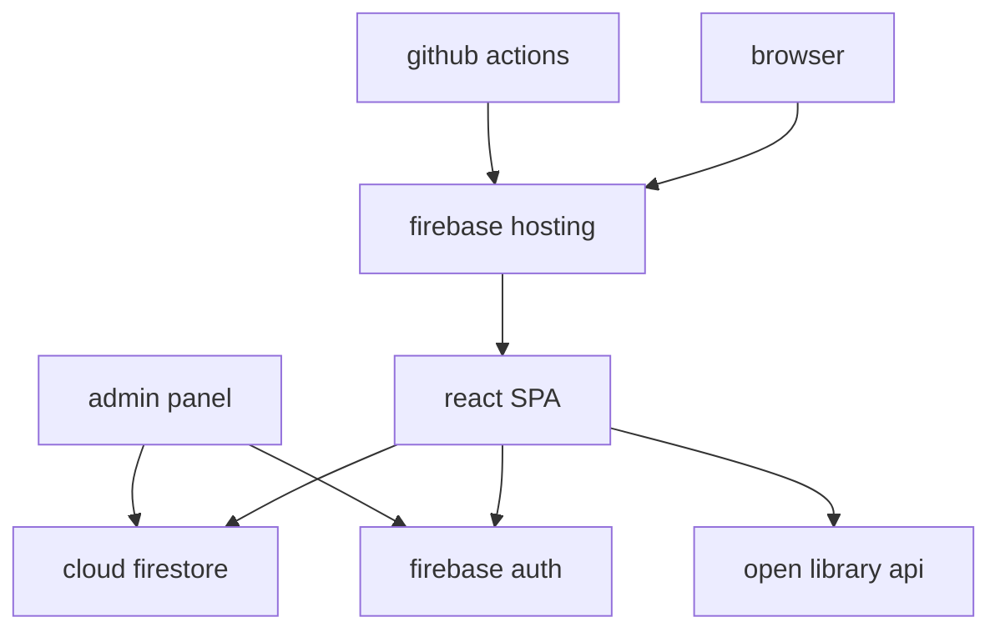
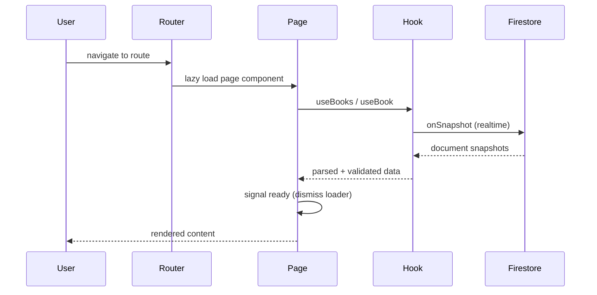
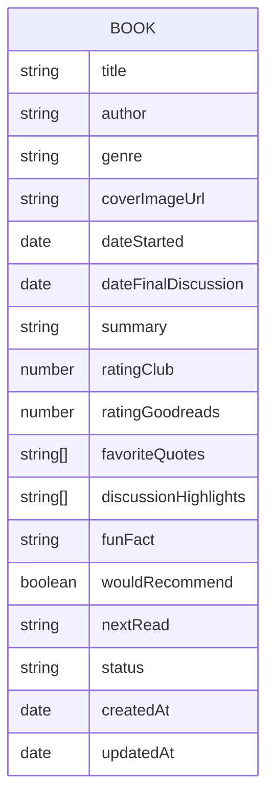
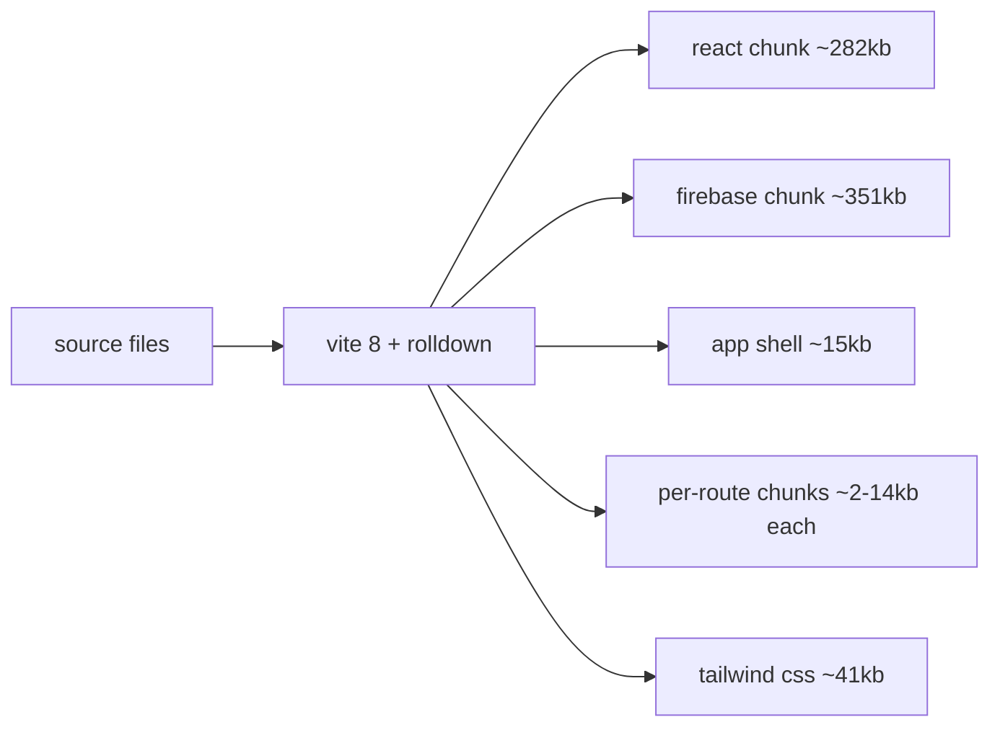
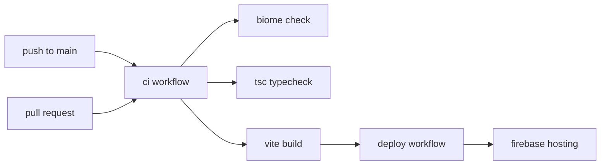

# architecture

## system overview



the app is a single-page react application hosted on firebase. firestore handles all data persistence, firebase auth gates the admin panel, and open library provides book cover lookups during book entry.

## request flow



all pages are lazy-loaded via `React.lazy`. a context-based loading system (`InitialLoadContext`) keeps a full-screen loader visible until the active page signals its data is ready.

## frontend structure

```
src/
  components/
    layout/
      header.tsx          # sticky nav, fullscreen mobile menu
      footer.tsx          # site footer with wave divider
      page-wrapper.tsx    # layout shell, loading screen, page transitions
      protected-route.tsx # auth gate for admin routes
    ui/
      ambient-dots.tsx    # floating animated dots for dark sections
      animate.tsx         # intersection observer fade-in wrapper
      book-card.tsx       # book grid card with 3d tilt
      book-cover.tsx      # image loader with shimmer + fallback icon
      book-shelf.tsx      # infinite scrolling cover carousel
      loading-spinner.tsx # centered spinner
      logo.tsx            # svg book stack logo
      pill.tsx            # genre/status tag
      quote-block.tsx     # single quote display
      quote-carousel.tsx  # sliding quote carousel with arrow nav
      section-label.tsx   # uppercase tracking label
      star-picker.tsx     # interactive star input (admin)
      star-rating.tsx     # read-only star display
      stat-counter.tsx    # animated number counter
      toast.tsx           # toast notification system
      wave-divider.tsx    # svg wave section divider
      hero-illustration.tsx # hero svg artwork
  hooks/
    use-animate.ts        # intersection observer for scroll animations
    use-auth.ts           # firebase auth state
    use-book.ts           # single book realtime subscription
    use-books.ts          # book collection realtime subscription
    use-initial-load.ts   # loading screen context + signals
    use-tilt.ts           # mouse-tracking 3d perspective tilt
  lib/
    firebase.ts           # firebase app + firestore + auth init
    open-library.ts       # cover image search via open library api
    schemas.ts            # zod schemas for book data validation
  pages/
    home.tsx              # hero, book shelf, stats, currently reading, recent reads
    books.tsx             # discover page with genre filters
    book-detail.tsx       # single book view with quotes, discussion, ratings
    about.tsx             # about the club
    contact.tsx           # contact info
    admin/
      login.tsx           # admin login form
      dashboard.tsx       # book management list
      book-form.tsx       # add/edit book form with cover auto-fetch
  utils/
    router.tsx            # route definitions with lazy loading
```

## data model



| field | type | description |
|---|---|---|
| status | enum | `completed`, `currently-reading`, `upcoming` |
| ratingClub | number | 0.5 - 5 (club's rating) |
| ratingGoodreads | number | 0.5 - 5 (goodreads rating for comparison) |
| coverImageUrl | string | open library url or manual url, can be empty |
| favoriteQuotes | string[] | minimum 1 required |
| discussionHighlights | string[] | minimum 1 required |

all book data is validated with zod schemas (`src/lib/schemas.ts`) on both read (firestore snapshots) and write (admin form submission).

## firestore rules

```
books/{bookId}:
  read:   anyone
  write:  authenticated users only
```

the admin panel is the only write path. public pages are read-only.

## build + bundle strategy



| strategy | implementation |
|---|---|
| code splitting | `React.lazy` per route, vendor chunks via `manualChunks` |
| vendor chunks | firebase and react split into separate cached chunks |
| css | tailwind v4 with vite plugin, single output file |
| assets | hashed filenames, `Cache-Control: immutable` via firebase hosting |
| tree shaking | firebase modular imports, no barrel files |

## visual effects (css-only)

| effect | technique |
|---|---|
| noise texture | svg `feTurbulence` as pseudo-element at 3.5% opacity |
| gradient mesh | layered `radial-gradient` on light and dark sections |
| glassmorphism | `backdrop-filter: blur` + semi-transparent background |
| 3d tilt | `perspective(600px) rotateX/Y` via mouse tracking hook |
| parallax | css variable `--scroll-y` set via throttled scroll listener |
| ambient dots | positioned divs with `translate` keyframe animations |
| page transitions | `animation: fadeIn` triggered by route key change |
| book shelf | infinite `translateX` animation with duplicated items |

all effects respect `prefers-reduced-motion` and no-op on touch devices where applicable.

## ci/cd pipeline



| trigger | workflow | steps |
|---|---|---|
| push to main | ci + deploy | lint, typecheck, build, deploy to firebase hosting |
| pull request | ci only | lint, typecheck, build (no deploy) |

## design decisions

| decision | rationale |
|---|---|
| no animation libraries | css transitions + react state keeps the bundle small and effects performant |
| firebase over custom backend | zero server management, realtime subscriptions, free tier sufficient for book club scale |
| zod validation on read + write | catches schema drift between firestore and the app, prevents rendering broken data |
| biome over eslint + prettier | single tool, faster, consistent formatting with zero plugin management |
| lazy routes + manual chunks | initial load only pulls the active page, vendor libs cached separately |
| open library for covers | free, no api key, isbn-based lookups with manual url fallback |
| tailwind v4 | `@theme` for design tokens, no config file, css-native approach |
